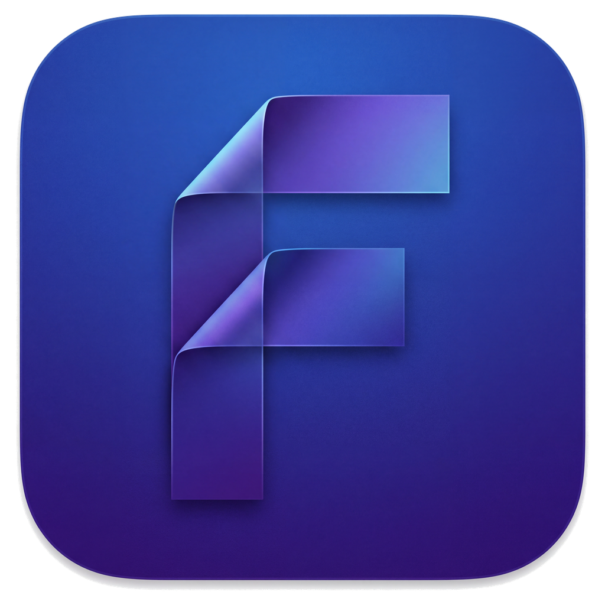
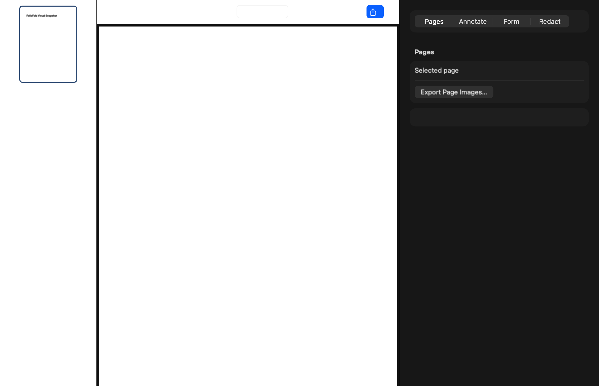

  

<h1 align="center">FolioFold</h1>

A private, native workspace for PDFs and structured documents on macOS.

  <a href="https://github.com/fmbabacan/FolioFold/releases/latest"><strong>Download FolioFold</strong></a> ·
  <a href="#install">Install</a> ·
  <a href="#what-you-can-do">Features</a> ·
  <a href="https://github.com/fmbabacan/FolioFold/issues">Support</a>

  
  
  
  

  

FolioFold brings document creation, PDF editing, conversion, organization, signing, and export into one focused Mac app. Document processing stays on the Mac. No account is required, and document contents are not uploaded to a service.

## Why FolioFold

- **Native Mac experience** built with Swift and SwiftUI.
- **Private by default** with local, offline-first document processing.
- **One workspace** for creating Folio documents and working with PDFs.
- **Safe document operations** that avoid overwriting source files by default.
- **Accessible interface** with keyboard navigation, VoiceOver labels, reduced-motion support, and light and dark appearances.
- **Open source** under the Apache License 2.0.

## Install

FolioFold requires **macOS 15 or later** and supports Apple Silicon and Intel Macs.

### Homebrew

~~~shell
brew install --cask fmbabacan/tap/foliofold
~~~

To update a Homebrew installation:

~~~shell
brew update
brew upgrade --cask foliofold
~~~

### Direct download

Download the latest signed and notarized build from [GitHub Releases](https://github.com/fmbabacan/FolioFold/releases/latest):

- **Apple Silicon:** choose the archive ending in <code>arm64.zip</code> for M1, M2, M3, M4, and newer Apple chips.
- **Intel:** choose the archive ending in <code>x86_64.zip</code>.

Open the ZIP archive, move <code>FolioFold.app</code> to Applications, and launch FolioFold normally. Official builds are signed with an Apple Developer ID certificate and notarized by Apple.

If the Mac architecture is unknown, open **Apple menu > About This Mac** and check the Chip or Processor field.

## What you can do

### Create and organize

- Build structured Folio documents from text, images, links, notes, and reusable template fields.
- Save editable <code>.foliofold</code> packages with recovery snapshots and workspace restoration.
- Work across multiple documents with tabs, recent files, undo, and redo.
- Protect Folio packages with local encryption.

### Work with PDFs

- Open, merge, split, reorder, rotate, duplicate, and export PDF pages.
- Convert supported text, image, RTF, and controlled local HTML files to PDF.
- Add notes, links, highlights, drawings, images, and form fields.
- Fill forms and add locally stored visual signatures.
- Apply destructive redactions to newly generated output without modifying the source PDF.

> A visual signature is an image annotation. It is not a certificate-backed cryptographic signature.

## Privacy and security

FolioFold performs document operations locally. The application does not require an account and does not send document contents to a remote processing service.

Official releases use a layered verification chain:

1. Developer ID code signing with the hardened runtime.
2. Apple notarization and a stapled notarization ticket.
3. Published SHA-256 checksums for Apple Silicon and Intel archives.
4. EdDSA-signed, processor-specific Sparkle update feeds.
5. Post-publication CI checks for signatures, architecture, checksums, and Gatekeeper acceptance.

Private release credentials remain in the release operator's macOS Keychain. They are not stored in this repository or GitHub Actions.

For security reports, follow [SECURITY.md](SECURITY.md). Please do not disclose vulnerabilities in a public issue.

## Updates

Choose **Help > Check for Updates** to use the signed Sparkle update flow. Apple Silicon and Intel installations each receive the correct processor-specific archive.

FolioFold 0.3.x did not include Sparkle. Moving from 0.3.x to 0.4.0 requires one manual installation from the Releases page. Updates after 0.4.0 can use the in-app update flow. The bundle identifier remains <code>app.foliofold.FolioFold</code>, preserving application identity and preferences.

## Build from source

Requirements:

- macOS 15 or later
- Xcode 26 or later
- Swift 6.1 or later

~~~shell
git clone https://github.com/fmbabacan/FolioFold.git
cd FolioFold
swift build
swift test
~~~

Run the complete local verification suite before opening a pull request:

~~~shell
scripts/verify.sh
~~~

The project pins [Sparkle](https://github.com/sparkle-project/Sparkle) 2.9.6 for secure application updates. Official signing, notarization, and Sparkle private keys are intentionally unavailable to ordinary source builds.

## Project guides

- [Architecture](docs/ARCHITECTURE.md)
- [Folio document format](FORMAT.md)
- [Publishing](docs/PUBLISHING.md)
- [Sparkle update model](docs/SPARKLE.md)
- [Homebrew distribution](docs/HOMEBREW.md)
- [Roadmap](docs/ROADMAP.md)

## Contributing

Contributions are welcome. Read [CONTRIBUTING.md](CONTRIBUTING.md) and the [Code of Conduct](CODE_OF_CONDUCT.md), then open a focused pull request with tests for behavior changes.

For bug reports and feature requests, use [GitHub Issues](https://github.com/fmbabacan/FolioFold/issues). For installation help, include the FolioFold version, macOS version, Mac architecture, and reproducible steps.

## License

FolioFold is available under the [Apache License 2.0](LICENSE).

Built for private, focused document work on the Mac.

